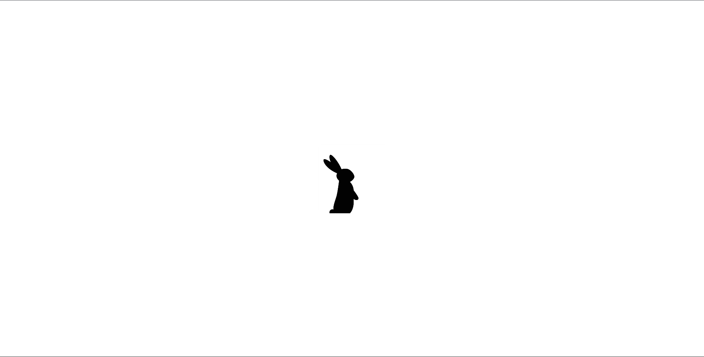

# 🏃‍♂️ Scared Button — Кнопка, которая боится мыши

Интерактивный мини-проект на HTML, CSS и JavaScript, в котором кнопка «боится» курсора мыши и убегает от него при приближении.

## 📌 Описание проекта

Когда пользователь двигает мышь и курсор приближается к кнопке на определённое расстояние, кнопка:

меняет изображение (анимация бега влево или вправо),

выбирает случайную новую позицию,

плавно перемещается в другое место экрана,

возвращается в состояние покоя после остановки.

## Проект демонстрирует:

работу с DOM

обработку событий mousemove

плавную анимацию через requestAnimationFrame()

вычисление расстояния между объектами

динамическую смену классов и изображений

## ⚙️ Технологии

HTML5

CSS3 (позиционирование, фоновые изображения, transition)

JavaScript (Vanilla JS)

[Demo](http://dashing-croquembouche-a0a6d7.netlify.app/)
